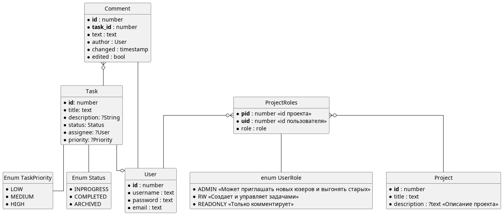
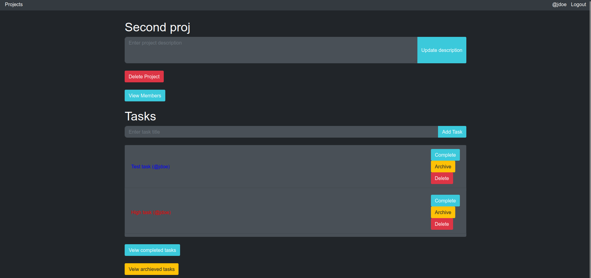
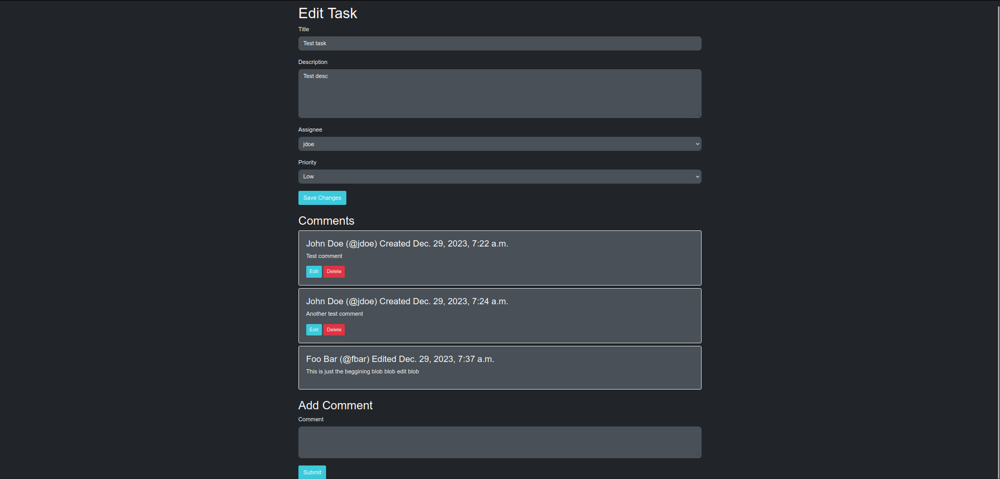
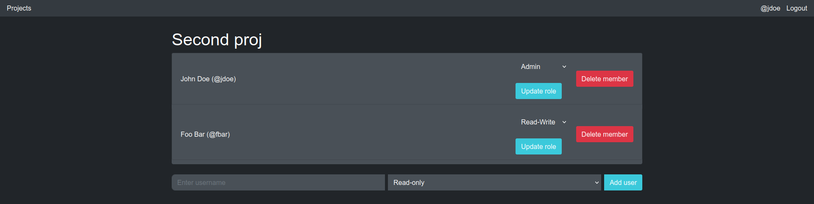

> Если бы у меня была неделька это все было бы куда безопаснее и красивее, а так... Два дня с джангой почти с нуля, по-моему неплохо

## Что это

Лабораторная. На скорую руку. Приложение для отслеживания заданий (Task Manager).

UML:

Вот страничка проекта:

Цвет текста - приоритет задачи, на главной странице отображаются только INPROGRESS задачи, архивные и завершенные живут отдельно. В скобках после названия handle закрепленного задачей человека. Модифицировать задачи можно только с правами RW и выше. READONLY только оставляет комментарии. Окно таска:

Редакт свойств таска + комментарии (edit на отдельую страничку отсылает).

Админ может добавлять и удалять новых пользователей:

## Как поднять у себя

Как и любой джанговский проект (смотри [скрипт](init_venv.sh))
